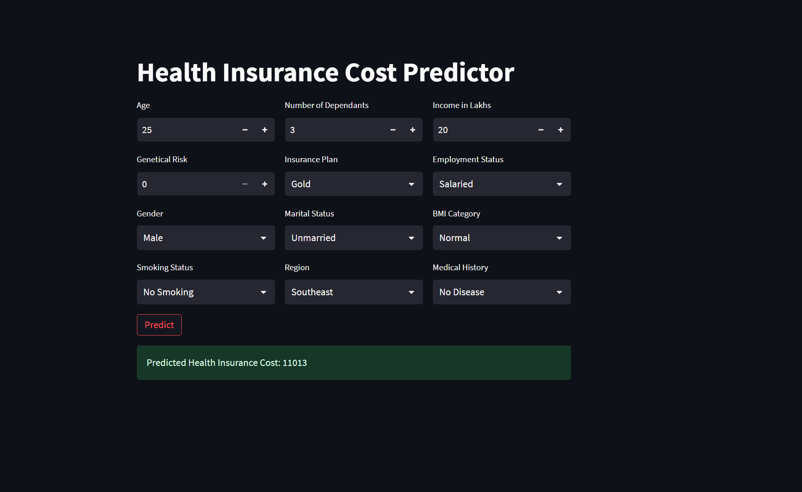

# Health Insurance Cost Predictor

This project is a machine learning-powered web application that predicts health insurance premium costs based on user inputs. It uses regression models trained on real insurance data and is built with [Streamlit](https://streamlit.io/) for an interactive user experience.

## Features

- Predicts annual health insurance premium based on age, income, medical history, and other factors.
- Interactive web UI for inputting user details.
- Uses trained regression models (Linear Regression, Ridge, XGBoost) for prediction.
- Handles categorical and numerical features, including medical risk scoring.
- Data preprocessing and feature engineering included in notebooks.

## Project Structure

├── main.py # Streamlit app entry point  
├── prediction_helper.py # Model loading, input preprocessing, prediction logic  
├── artifacts/ # Trained models and scalers (.joblib files)  
├── Data/ # Raw and processed data files (.xlsx)  
├── NoteBooks/ # Jupyter notebooks for EDA, feature engineering, model training  
├── requirements.txt # Python dependencies  
├── README.md # Project documentation  
├── LICENSE # License information  
└── .gitignore # Git ignore rules

## How It Works

1. **User Input:** The app collects user details (age, income, medical history, etc.) via the Streamlit UI ([main.py](main.py)).
2. **Preprocessing:** Inputs are encoded and scaled to match the model's expectations ([prediction_helper.py](prediction_helper.py)).
3. **Prediction:** The appropriate model is selected based on age, and the premium is predicted.
4. **Result:** The predicted premium is displayed to the user.

## Model Training

- Data cleaning, feature engineering, and model training are documented in the Jupyter notebooks ([NoteBooks/Main_notebook.ipynb](NoteBooks/Main_notebook.ipynb), [NoteBooks/Model_Young_withGR.ipynb](NoteBooks/Model_Young_withGR.ipynb), [NoteBooks/Model_Rest_with_gr.ipynb](NoteBooks/Model_Rest_with_gr.ipynb)).
- Models and scalers are saved in the [artifacts/](artifacts/) directory for use in the app.

## Live Demo

The app is deployed and available at:  
**[https://apurv-health-insurance-prediction.streamlit.app/](https://apurv-health-insurance-prediction.streamlit.app/)**

## Example

